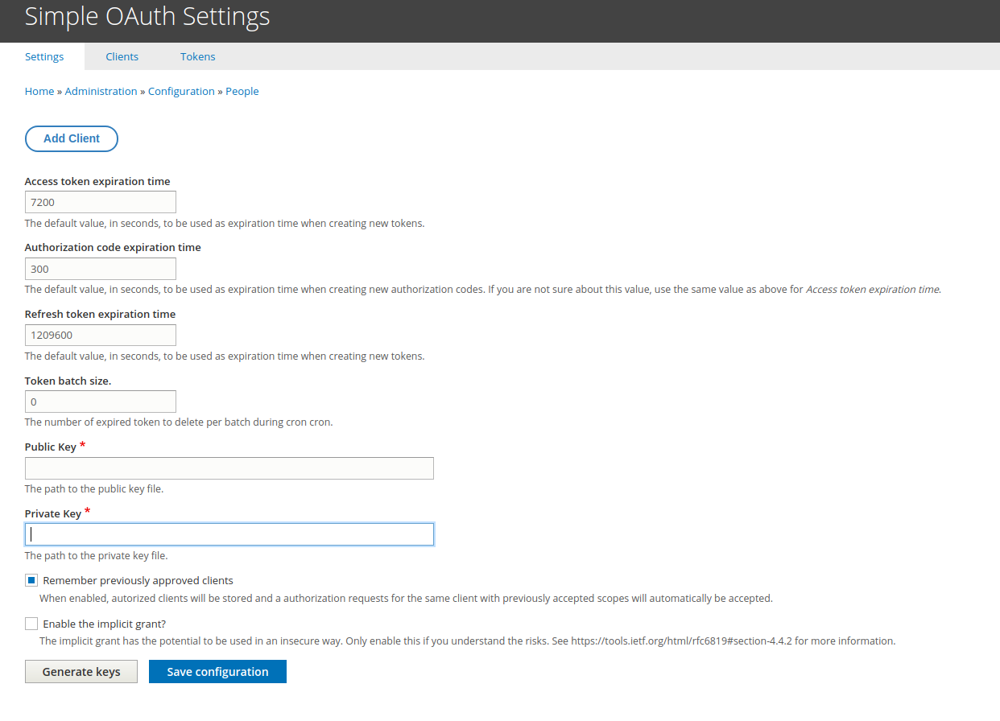

# PECE simple oAuth 

Settings for oAuth

## Certificates
We need to generate a pair of keys, one public and the other private, to encrypt the tokens generated by Simple OAuth. These keys should be stored outside of the Drupal project root, but save the paths at which they are located for future reference.

### Generating certificates

```shell
openssl genrsa -out private.key 2048
openssl rsa -in private.key -pubout > public.key
```

## Setup module

Navigate to configuration module `/admin/config/people/simple_oauth`



In the `Public key` and` Private key` fields, you put generated certificate files path, using the commands in the section [Generating certificates](#generating-certificates)

### Create a Consumer

Navigate to consumer configuration option `/admin/config/services/consumer` and click on button **Add customer**


### .env variables

Key                        | Description                                        
-------------------------- | -----------------------------------------------------------------------------
`NUXT_AUTH_CLIENT_ID`      | The UUID of the consumer, for example: 7f05a6f7-c652-47d0-ab90-70bf739c523f
`NUXT_AUTH_CLIENT_SECRET`  | The client secret provided during the addition of the consumer.


