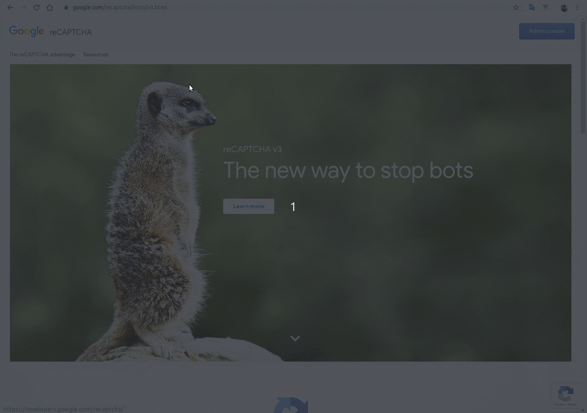
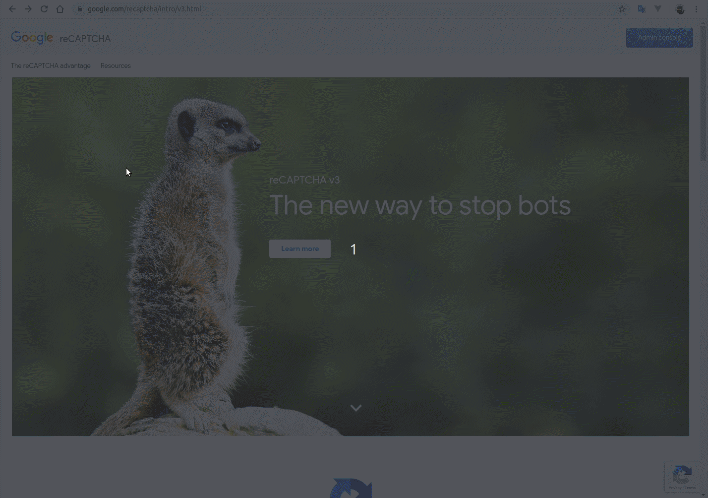

# PECE reCAPTCHA

Settings for Google reCAPTCHA

## Add site in Google recaptcha

We will need to have version 2 and 3 of the recaptcha on the website.

- Version 2 (invisible) will be used to generate the challenge "I am not a robot" when the number of login attempts with error is greater than that determined in the key [`NUXT_AUTH_LIMIT_LOGIN_ATTEMPT`](#add-in-env) or when it has a low score determined by reCAPTCHA v3 verification;
- Version 3 will be used to check the user's score before each login, if you have a low score, you will be asked to resolve the reCAPTCHA v2;

### Creating reCAPTCHA v2

Navigate to <a href="https://www.google.com/recaptcha/admin" target="_blank">Console Google reCAPTCHA</a> and create a new invisible reCAPTCHA v2

### Creating reCAPTCHA v3

Navigate to <a href="https://www.google.com/recaptcha/admin" target="_blank">Console Google reCAPTCHA</a> and create new reCAPTCHA v3

## Add in .env

Key                               | Description                                                           | Default                      
--------------------------------- | --------------------------------------------------------------------- | -----------
`NUXT_AUTH_LIMIT_LOGIN_ATTEMPT`   | Number of invalid login attempts to request the reCAPTCHA challenge   | 5
`NUXT_RECAPTCHA_SITE_KEY_V2`      | SITE KEY reCAPTCHA v2                                                 | 
`NUXT_RECAPTCHA_SITE_KEY_V3`      | SITE KEY reCAPTCHA v3                                                 | 