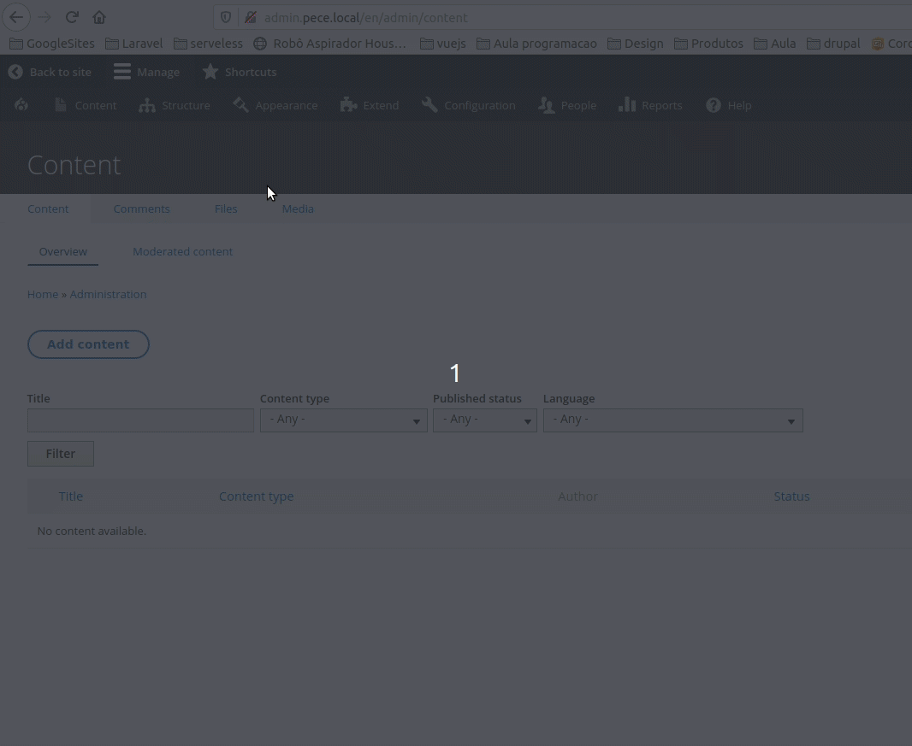

# PECE N8N

This integration is the responsible for all automations on PECE project.

## Setup

### .env variables
- **N8N_CLIENT_ID**: Consumer UUID to use with OAuth 2.0 and get API.
- **N8N_CLIENT_SECRET**: Client secret in consumer.
- **WEBHOOK_N8N_USERNAME**: Username to send message to n8n.
- **WEBHOOK_N8N_PASSWORD**: Password to send message to n8n.
- **N8N_HTTP_ACCESS**: User and password to authenticate in n8n url.

Below has the explanation about each variable

#### N8N_CLIENT_ID
After install PECE project, you need get the consumer UUID and put in this variable

1- Access `Configuration > Web Service > Consumer`

2- Copy UUID from n8n consumer or other consumer.

#### N8N_HTTP_ACCESS
1- Use this command in your terminal `echo $(htpasswd -nb user password)` where `user` and `password` are
the login in the http url access.

2- Get result terminal and put in the `N8N_HTTP_ACCESS` variable in `.env` file.

3- Start/Restart n8n docker service.

### Automations

#### n8n (nodemations)
Before continue it's important you know N8N
Tutorials: https://docs.n8n.io/#/tutorials

Here has many examples: https://n8n.io/workflows

#### n8n in PECE Project

##### Folder structure

- **enabled**: Folder with the jsons files to need run.
- **base_pece_automation.json**: Base to start your automations.

##### Creating automation
1- Import json base file

2- Copy client id to connect in the API

##### Enable automations
Run `make start-automations` after install PECE project or update/create automations