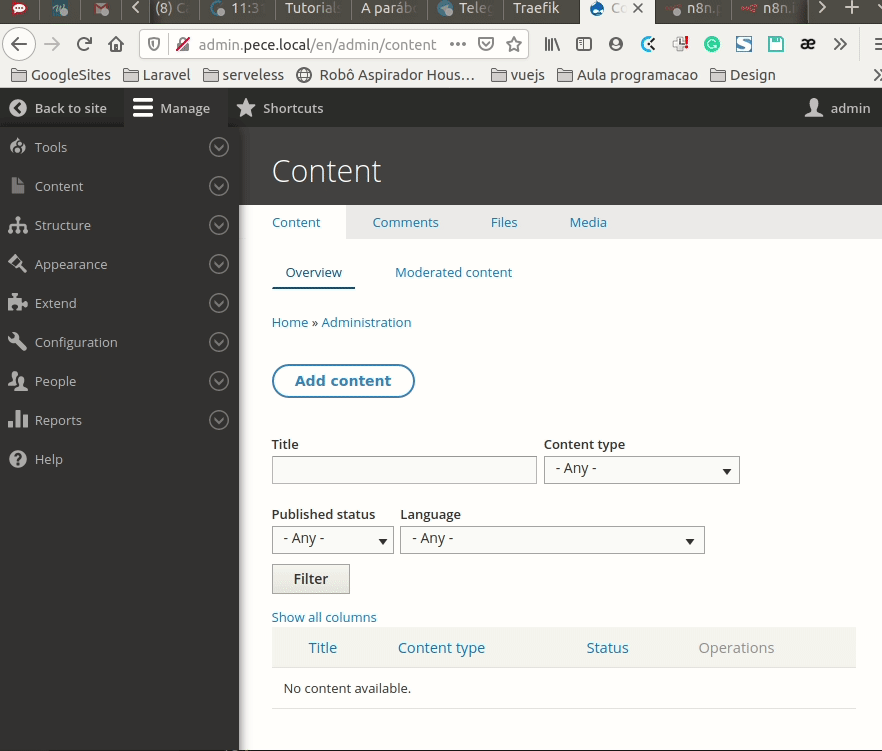
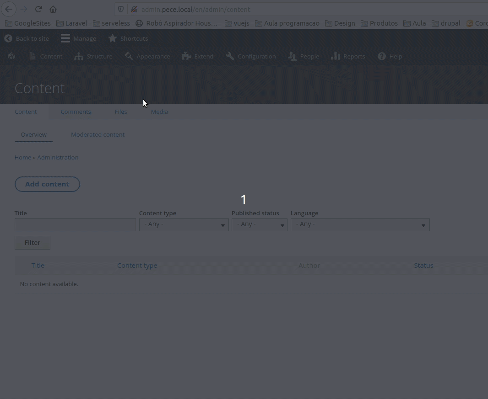
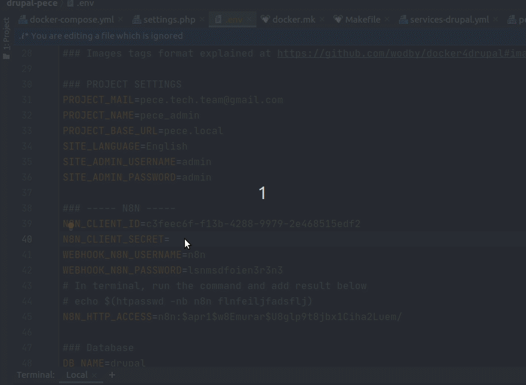
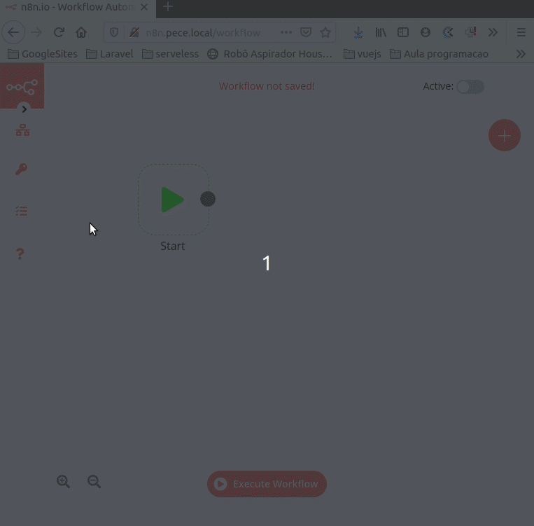
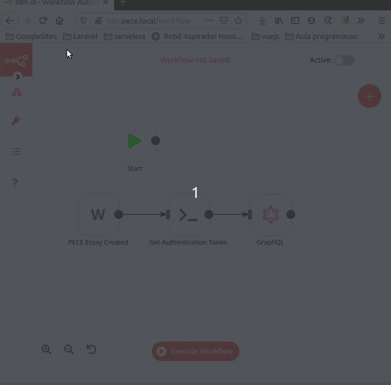
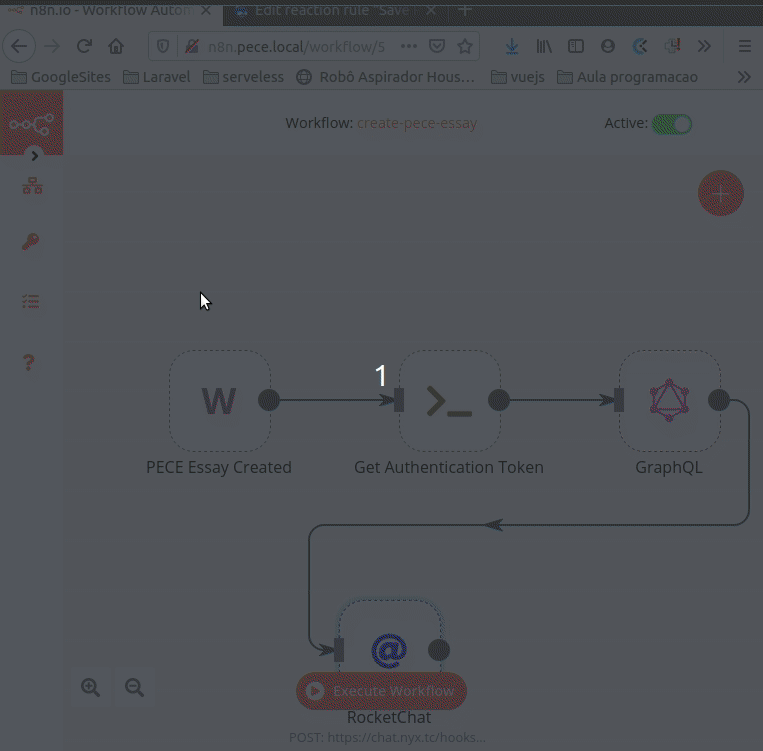
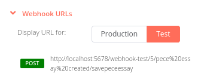
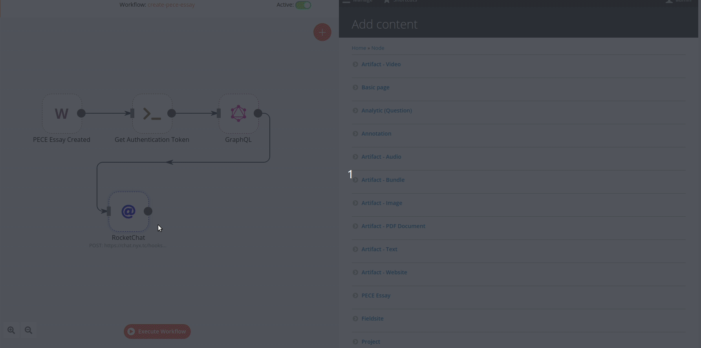
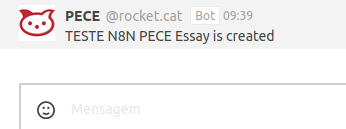
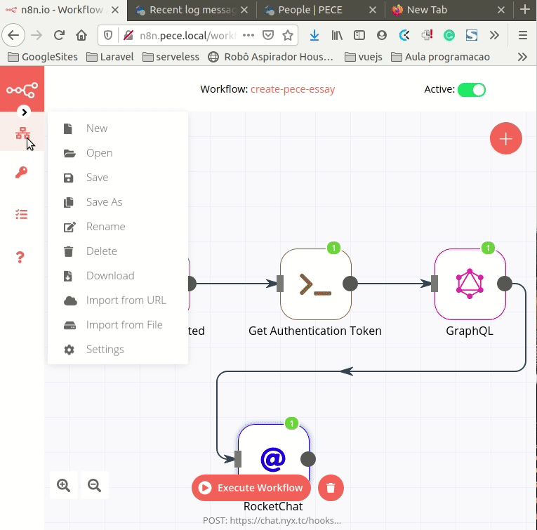

# PECE N8N - Nodemation

This integration handles all automation on PECE project.

## Setup

### .env file variables
- **N8N_CLIENT_ID**: Consumer UUID to use with OAuth 2.0 and access the API.
- **N8N_CLIENT_SECRET**: Client secret in Consumer.
- **SITE_N8N_USERNAME**: Username of N8N user on your PECE website.
- **SITE_N8N_PASSWORD**: Password of N8N user on your PECE website.
- **N8N_HTTP_ACCESS**: User and password to authenticate on N8N URL.

Below there is more details on each of the `.env` file variables:

#### SITE_N8N_USERNAME and SITE_N8N_PASSWORD

**Important:**
- You must repeat the following steps every time N8N user and password has changed. 
- You should skip this step if you have already set the variables before installing PECE project.
 
1- Define password to N8N user in the PECE Project. You can also change N8N username as needed.


2- Add the updated username and password on `SITE_N8N_USERNAME` and `SITE_N8N_PASSWORD` variables.

#### N8N_CLIENT_ID
After installing PECE project, you have to get Consumer UUID and set `N8N_CLIENT_ID` variable.

1- Access Consumer settings page at `Configuration > Web Service > Consumer`

2- Copy UUID from N8N consumer.



#### N8N_CLIENT_SECRET
You have to create the client secret in the consumer.

1- Set client secret on `.env` file

2- Copy and paste client secret on the consumer




#### N8N_HTTP_ACCESS

**Important**
- You must have `apache2-utils` library already installed to use the command on step 1.  

1- Run following command on your terminal `echo $(htpasswd -nb user password)` in which `user` and `password` are
the login credentials for HTTP URL access.

2- Get previous command output on the terminal and set it on `N8N_HTTP_ACCESS` variable in `.env` file.

3- Start/Restart n8n docker service.

Example with user `test` and password `test`
```shell
$ echo $(htpasswd -nb test test)
test:$apr1$5/03Eb6p$5Zk5OB.xI.j0HBlT69heb.
```

### Automation

#### n8n (nodemation)
Before continuing, it's highly recommended knowing N8N.
**Tutorials:** https://docs.n8n.io/#/tutorials

There are many more examples: https://n8n.io/workflows

#### n8n in PECE Project

##### Folder structure


- **enabled**: Folder with the JSON files to run.
- **base_pece_automation.json**: Base to start an automation.

##### Creating workflow
1- Import the json base file


- **PECE Essay Created**: Webhook example to call when a new PECE Essay is created
- **Get Authentication Token**: Call a python script using `.env` file variables to create the OAuth 2.0 token.
- **GraphQL**: Call PECE API to get the information needed 

You can access each node to see the settings.

2- Complete your workflow with other nodes.

3- Save the workflow and enable it.



4- Create the rule event on PECE project to call your workflow. The `save_pece_essay` workflow is installed by default.

1.  Access `Configuration > Workflow > Rules > Edit save_pece_essay`
2.  Edit `Webhook Post` Action
3.  Update URL to your webhook URL.


4.  Update `API User Name` and `API User Password` to your custom credentials if you have added Authentication property for the Webhook node on n8n.
5.  Save your rule.

5- Test your workflow.

1.  To test it you have to change your Webhook URL on the rule to test URL, step 4



2.  Click on `Execute Workflow`

3.  Now, create a new PECE Essay




Check the result in RocketChat:




6- Download your workflow and add it on the `n8n-automation/enabled` directory. Don't forget to change the test URL to the final URL on PECE Project when live on production server.


##### Enable automations
Run `make start-automation` after installing the PECE project, or update/create workflows