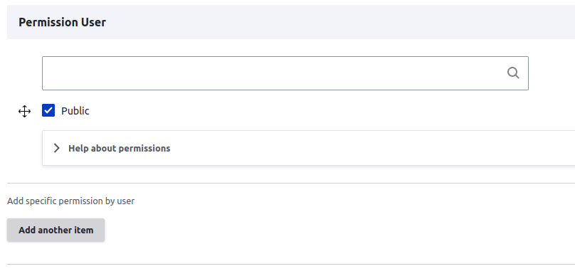

# User permissions

All content is public, but you can change this using the `Permission User` field

1) Add user name in the first field.
2) Uncheck Public visibility.
3) Select the permission this user can have.
