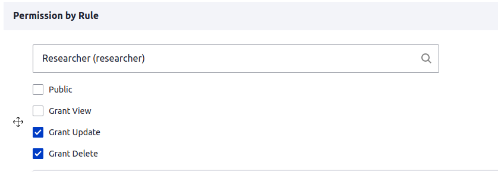

# Role permissions

All content is public, but you can change this using the `Permission by Role` field.

1) Add role name in the first field.
2) Uncheck Public visibility.
3) Select the permission this user can have.
